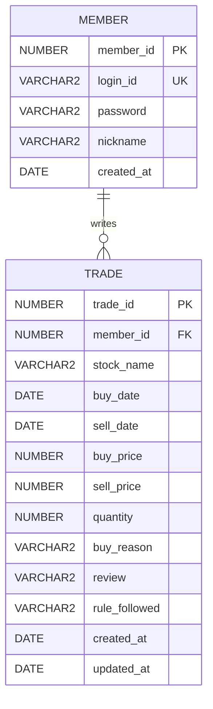

# TradeLog ERD

## 관계

MEMBER : TRADE = 1 : N

한 명의 회원은 여러 개의 매매일지를 작성할 수 있다.
하나의 매매일지는 하나의 회원에게 속한다.

## 주요 제약조건

| Table | Column | Constraint |
|---|---|---|
| MEMBER | MEMBER_ID | PK |
| MEMBER | LOGIN_ID | UNIQUE / NOT NULL |
| TRADE | TRADE_ID | PK |
| TRADE | MEMBER_ID | FK → MEMBER.MEMBER_ID |