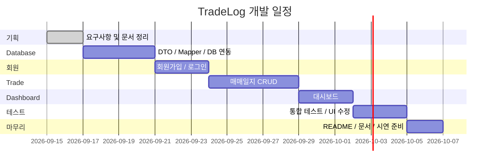

# TradeLog Development Schedule

```mermaid
gantt
    title TradeLog 개발 일정
    dateFormat YYYY-MM-DD

    section 기획
    요구사항 및 문서 정리       :done, plan, 2026-09-15, 2d

    section Database
    DTO / Mapper / DB 연동      :db, after plan, 4d

    section 회원
    회원가입 / 로그인           :member, after db, 3d

    section Trade
    매매일지 CRUD              :trade, after member, 5d

    section Dashboard
    대시보드                   :dashboard, after trade, 3d

    section 테스트
    통합 테스트 / UI 수정       :test, after dashboard, 3d

    section 마무리
    README / 문서 / 시연 준비    :docs, after test, 2d
```